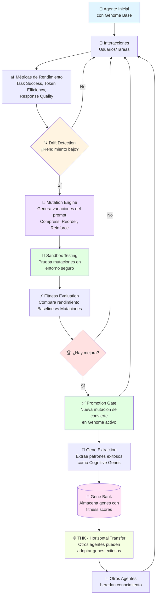

# 🧬 PGA PLATFORM - PROCESO COMPLETO
## Cómo PGA hace agentes autónomos, inteligentes y evolutivos

---

## 🎯 DIAGRAMA DE FLUJO PRINCIPAL



---

## 📋 EXPLICACIÓN DETALLADA DEL PROCESO

### 1️⃣ **AGENTE INICIAL**
- Agente empieza con un **Genome Base** (sistema de prompts)
- Cromosoma 0: Prompt base del sistema
- Cromosoma 1: Preferencias del usuario
- Cromosoma 2: Genes cognitivos adoptados

### 2️⃣ **INTERACCIONES**
- El agente interactúa con usuarios y ejecuta tareas
- Cada interacción genera **métricas de rendimiento**:
  - ✅ Task Success Rate
  - ⚡ Token Efficiency
  - 📝 Response Quality
  - 😊 User Satisfaction

### 3️⃣ **DRIFT DETECTION** 🔍
- **Sistema proactivo** que monitorea rendimiento 24/7
- Detecta cuándo el agente empieza a degradarse:
  - ❌ Más errores
  - 🐌 Respuestas más lentas
  - 📉 Calidad bajando
- **Activa evolución automáticamente** cuando detecta drift

### 4️⃣ **MUTATION ENGINE** 🧬
Genera variaciones inteligentes del prompt usando operadores:

**Compress Instructions:**
```
ANTES: "You are a helpful assistant that provides detailed..."
DESPUÉS: "Helpful assistant. Provide concise, accurate..."
```

**Reorder Constraints:**
```
ANTES: [Safety rules al final]
DESPUÉS: [Safety rules al principio - más impactantes]
```

**Safety Reinforcement:**
```
Refuerza reglas críticas de seguridad y ética
```

**Tool Selection Bias:**
```
Ajusta preferencias de qué herramientas usar primero
```

### 5️⃣ **SANDBOX TESTING** 🧪
- Las mutaciones se prueban en **entorno aislado**
- Usa casos de prueba predefinidos
- **Sin riesgo** para producción
- Simula interacciones reales

### 6️⃣ **FITNESS EVALUATION** ⚡
Compara rendimiento entre:
- 📊 **Baseline** (genome actual)
- 🧬 **Mutaciones** (nuevas versiones)

Evalúa:
- Task Success: ¿Completa tareas correctamente?
- Token Efficiency: ¿Usa menos tokens?
- Response Quality: ¿Respuestas mejores?
- Safety: ¿Mantiene reglas de seguridad?

### 7️⃣ **PROMOTION GATE** ✅
Sistema de **validación estricta**:
- ✅ Mejora > 5% en fitness
- ✅ Pasa todas las pruebas de seguridad
- ✅ No rompe funcionalidad existente
- ✅ Validación semántica de respuestas

**Solo si pasa TODO → Se promueve a producción**

### 8️⃣ **GENE EXTRACTION** 🧬
Extrae patrones exitosos como **Cognitive Genes**:

```typescript
{
  name: "Error Recovery Pattern",
  type: "error-recovery-pattern",
  fitness: 0.92,
  content: {
    instruction: "When error: 1) Log, 2) Check recoverable, 3) Retry...",
    examples: [...],
    applicableContexts: ["api-calls", "external-services"]
  }
}
```

### 9️⃣ **GENE BANK** 🏦
**Repositorio central de conocimiento:**
- Almacena genes de todos los agentes
- Organiza por tipo, dominio, fitness
- Searchable: Otros agentes pueden buscar
- Versionado: Mantiene histórico de evolución

**Tipos de genes:**
- 🔧 Tool Usage Patterns
- 🎯 Reasoning Patterns
- ❌ Error Recovery Patterns
- 🛡️ Safety Protocols
- 💬 Communication Styles

### 🔟 **THK - HORIZONTAL KNOWLEDGE TRANSFER** 🌐

**¡La magia de PGA!** - Conocimiento entre agentes:

```
Agente A [Customer Support]
  → Desarrolla patrón exitoso de "Escalation Handling"
  → Extrae como gene con fitness 0.95
  → Sube al Gene Bank

Agente B [Sales Support]
  → Busca genes de "customer-interaction"
  → Encuentra "Escalation Handling" gene
  → Lo prueba en sandbox
  → ¡Funciona! → Lo adopta
  → Ahora Agente B también sabe escalar issues
```

**Sin THK:** Cada agente aprende desde cero
**Con THK:** Toda la red de agentes aprende colectivamente

---

## 🔄 CICLO DE EVOLUCIÓN AUTÓNOMA

```
┌─────────────────────────────────────────┐
│  Interact → Metrics → Drift Detection   │
│             ↓                            │
│      ¿Performance Drop?                  │
│             ↓                            │
│  Mutate → Test → Evaluate → Promote     │
│             ↓                            │
│    Extract Gene → Gene Bank              │
│             ↓                            │
│      THK → Other Agents                  │
│             ↓                            │
│    [LOOP CONTINUES FOREVER] ♾️           │
└─────────────────────────────────────────┘
```

**CLAVE:** Todo esto pasa **automáticamente** sin intervención humana.

---

## 🚀 BENEFICIOS DEL SISTEMA

### 1. **INTELIGENCIA CRECIENTE** 🧠
- Agente mejora continuamente con cada interacción
- Aprende de errores automáticamente
- Optimiza su propio prompt sin humanos

### 2. **AUTONOMÍA TOTAL** 🤖
- Detecta problemas solo
- Genera soluciones solo
- Se auto-mejora solo
- **Cero intervención humana necesaria**

### 3. **EVOLUCIÓN COLECTIVA** 🌐
- 1 agente aprende → 1000 agentes aprenden
- Conocimiento se distribuye instantáneamente
- Red completa evoluciona junta
- **Network Effect masivo**

### 4. **RESILIENCIA** 🛡️
- Si rendimiento cae → Auto-repara
- Sandbox testing previene roturas
- Promotion gate asegura calidad
- **Self-healing system**

### 5. **EFICIENCIA** ⚡
- Menos tokens usados
- Respuestas más rápidas
- Mejor calidad
- **Costos reducidos + Mejor experiencia**

---

## 📊 EJEMPLO REAL DE EVOLUCIÓN

```
DÍA 1:
  Agente Customer Support v1.0
  - Task Success: 70%
  - Avg Response Time: 5s
  - User Satisfaction: 3.5/5

↓ [Drift Detection: Success rate bajó a 65%]
↓ [Mutation Engine genera 5 variaciones]
↓ [Sandbox testing evalúa todas]
↓ [Mejor mutación: +15% success rate]
↓ [Promotion Gate: ✅ APROBADA]

DÍA 7:
  Agente Customer Support v2.3
  - Task Success: 85% ⬆️ +15%
  - Avg Response Time: 3.2s ⬆️ -36%
  - User Satisfaction: 4.2/5 ⬆️ +20%

↓ [Gene Extraction: "Customer Empathy Pattern"]
↓ [Gene Bank: Stored with fitness 0.89]
↓ [THK: 5 otros agentes adoptan el gene]

DÍA 30:
  TODA LA RED mejoró:
  - 10 agentes usando "Customer Empathy Pattern"
  - Promedio network success: 87%
  - Genes totales en banco: 47
  - Evoluciones totales: 156
```

---

## 🎨 ANALOGÍA PARA ENTENDERLO FÁCIL

**PGA es como un equipo de Pokémon que evoluciona solo:**

1. **Pokémon Base** = Agente inicial con genome
2. **Batallas** = Interacciones con usuarios
3. **Experiencia** = Métricas de rendimiento
4. **Evolución** = Mutation + Promotion
5. **Movimientos Aprendidos** = Cognitive Genes
6. **Intercambio de Pokémon** = THK entre agentes

**PERO mejor que Pokémon porque:**
- ❌ Pokémon: Necesitas pelear para evolucionar
- ✅ PGA: Evoluciona automáticamente mientras trabaja

- ❌ Pokémon: Solo aprende 4 movimientos
- ✅ PGA: Aprende ilimitados genes

- ❌ Pokémon: No comparte conocimiento
- ✅ PGA: THK comparte todo con toda la red

---

## 🏗️ ARQUITECTURA TÉCNICA SIMPLIFICADA

```
┌──────────────────────────────────────────────┐
│           🧬 PGA PLATFORM                     │
├──────────────────────────────────────────────┤
│                                               │
│  ┌─────────────┐      ┌──────────────┐      │
│  │ Drift       │─────▶│ Mutation     │      │
│  │ Analyzer    │      │ Engine       │      │
│  └─────────────┘      └──────────────┘      │
│         │                     │               │
│         ▼                     ▼               │
│  ┌─────────────┐      ┌──────────────┐      │
│  │ Fitness     │◀─────│ Sandbox      │      │
│  │ Calculator  │      │ Tester       │      │
│  └─────────────┘      └──────────────┘      │
│         │                     │               │
│         ▼                     ▼               │
│  ┌─────────────┐      ┌──────────────┐      │
│  │ Promotion   │─────▶│ Gene         │      │
│  │ Gate        │      │ Extractor    │      │
│  └─────────────┘      └──────────────┘      │
│                              │                │
│                              ▼                │
│                     ┌──────────────┐         │
│                     │ Gene Bank    │         │
│                     │ (Storage)    │         │
│                     └──────────────┘         │
│                              │                │
│                              ▼                │
│                     ┌──────────────┐         │
│                     │ THK Manager  │         │
│                     │ (Transfer)   │         │
│                     └──────────────┘         │
│                                               │
└──────────────────────────────────────────────┘
```

---

## 💡 CASOS DE USO

### Customer Support 🎧
- Aprende mejores respuestas de empatía
- Detecta y escala issues complejos
- Optimiza tiempo de resolución
- **Resultado:** -40% tiempo de respuesta, +35% satisfacción

### Sales Agent 💼
- Aprende técnicas de closing efectivas
- Detecta objeciones y las maneja mejor
- Personaliza pitch según usuario
- **Resultado:** +28% conversion rate

### Coding Assistant 💻
- Aprende patrones de código exitosos
- Detecta bugs antes de escribir código
- Optimiza sugerencias según contexto
- **Resultado:** +45% código aceptado, -60% bugs

### Content Creator ✍️
- Aprende estilos de escritura que funcionan
- Detecta tono apropiado para audiencia
- Optimiza engagement
- **Resultado:** +52% engagement, +38% shares

---

## 🎯 LLAMADO A LA ACCIÓN

### Para Developers:
```bash
npm install @pga-ai/core
# 3 líneas de código = Agente autónomo evolutivo
```

### Para Empresas:
- **Reducción de costos:** -40% en tokens
- **Mejor rendimiento:** +35% en task success
- **Sin mantenimiento:** Evoluciona solo
- **Network effect:** Cada agente mejora a todos

### Para Investors:
- **IP protegida:** 3 patentes pendientes
- **Moat técnico:** 20 años de protección
- **First mover:** Primera plataforma de evolución autónoma
- **Mercado:** $150B AI agents market 2026

---

## 📞 CONTACTO & RECURSOS

- **GitHub:** github.com/pga-ai/pga-platform
- **Docs:** docs.pga.ai
- **Demo:** demo.pga.ai
- **Email:** hello@pga.ai

---

**🧬 PGA PLATFORM**
*The Living OS for AI Agents*

**Patent Pending** | **Made with Claude Sonnet 4.5** | **2026**
