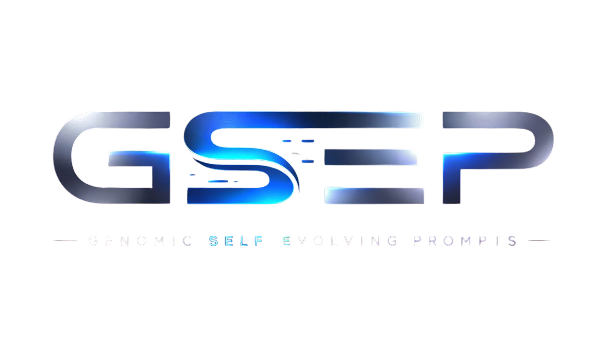

<div align="center">



<br>

# 🧬 GSEP — Make Your AI Agent Self-Evolving


[](LICENSE.md)
[](https://www.npmjs.com/package/@pga-ai/core)
[](https://github.com/gsepcore/pga-platform/actions/workflows/ci.yml)
[](PATENTS.md)
[](https://www.youtube.com/watch?v=cTPJqrL2IyE)

**Drop-in upgrade that makes any AI agent learn, adapt, and evolve autonomously.**

Created by **Luis Alfredo Velasquez Duran** | Germany, 2025–2026

[Website](https://gsepcore.com) · [Documentation](https://gsepcore.com) · [GitHub](https://github.com/gsepcore/pga-platform)

</div>

---

## What is GSEP?

**GSEP is not a framework to build agents.** You already have an agent — GSEP makes it better.

GSEP wraps your existing agent's LLM calls with a genomic evolution layer. Your agent's prompts stop being static text and become **living organisms** that mutate, adapt, and improve with every interaction.

```
YOUR AGENT (before)                YOUR AGENT (after GSEP)
┌──────────────────┐               ┌──────────────────┐
│  Static prompt   │               │  🧬 Evolving prompt  │
│  Same for all    │   + GSEP →   │  Adapts per user      │
│  Never improves  │               │  Auto-improves        │
│  Manual tuning   │               │  Self-healing         │
└──────────────────┘               └──────────────────┘
```

---

## ⭐ Star This Repo

Every star helps more developers discover GSEP. If this project is useful to you, please leave a star — it takes 1 second and means a lot.

<a href="https://github.com/gsepcore/pga-platform/stargazers">
  
</a>
<a href="https://github.com/gsepcore/pga-platform/network/members">
  
</a>

---

## 🚀 Install in Your Existing Agent (3 Steps)

### Step 1: Install

```bash
# Pick your LLM provider:
npm install @pga-ai/core @pga-ai/adapters-llm-anthropic  # Claude
npm install @pga-ai/core @pga-ai/adapters-llm-openai      # GPT-4
npm install @pga-ai/core @pga-ai/adapters-llm-google       # Gemini
npm install @pga-ai/core @pga-ai/adapters-llm-ollama       # Local models (Llama, Mistral, etc.)
npm install @pga-ai/core @pga-ai/adapters-llm-perplexity   # Perplexity (web search)
```

### Step 2: Initialize GSEP (once, at startup)

```typescript
// gsep-setup.ts — add this file to your project
import { PGA, InMemoryStorageAdapter } from '@pga-ai/core';
import { ClaudeAdapter } from '@pga-ai/adapters-llm-anthropic';

const llm = new ClaudeAdapter({
  apiKey: process.env.ANTHROPIC_API_KEY!,
  model: 'claude-sonnet-4-5-20250929',
});

const gsep = new PGA({
  llm,
  storage: new InMemoryStorageAdapter(),  // or PostgresAdapter for production
});
await gsep.initialize();

// Create the genome — this is your agent's evolving brain
export const genome = await gsep.createGenome({
  name: 'my-agent',
  config: {
    autonomous: {
      continuousEvolution: true,   // Auto-evolve every N interactions
      evolveEveryN: 10,
      autoMutateOnDrift: true,     // Self-heal when performance drops
      enableSelfModel: true,       // Agent knows its strengths/weaknesses
      enablePatternMemory: true,   // Learns behavioral patterns
    },
  },
});
```

### Step 3: Replace your LLM call

```typescript
// BEFORE — direct LLM call in your agent:
const response = await llm.chat(userMessage);

// AFTER — route through GSEP:
import { genome } from './gsep-setup.js';

const response = await genome.chat(userMessage, {
  userId: user.id,
  taskType: 'support',  // or 'coding', 'analysis', etc.
});
// response is a string — drop-in replacement, same interface
```

**That's it.** Your agent now evolves autonomously.

---

## What changes after installing GSEP?

| Before GSEP | After GSEP |
|------------|-----------|
| Same prompt for every user | Adapts per user automatically |
| Performance degrades over time | Self-heals when drift detected |
| Manual prompt tuning | Evolves every 10 interactions |
| No memory between sessions | Remembers user patterns |
| Blind to its own weaknesses | Self-aware (SelfModel) |
| Isolated knowledge | Shares learnings across agents (THK) |

---

## 🧬 How It Works

GSEP adds a **four-layer chromosome** around your agent's prompts:

```
┌─────────────────────────────────────────┐
│  C0: Immutable DNA                      │
│  (Security, Ethics, Core Identity)      │
│  🔒 NEVER mutates — SHA-256 protected  │
├─────────────────────────────────────────┤
│  C1: Operative Genes                    │
│  (Tool Usage, Coding Patterns)          │
│  🐢 SLOW mutation (sandbox-tested)     │
├─────────────────────────────────────────┤
│  C2: Epigenomes                         │
│  (User Preferences, Style)              │
│  ⚡ FAST mutation (adapts daily)       │
├─────────────────────────────────────────┤
│  C3: Content Firewall                   │
│  (Prompt Injection Defense)             │
│  🛡️ 53 patterns — SHA-256 core        │
└─────────────────────────────────────────┘
```

Every interaction flows through a **four-phase evolution cycle**:

```
1. TRANSCRIPTION → Log the interaction
2. VARIATION     → Generate prompt mutations
3. SIMULATION    → Test in sandbox (safe)
4. SELECTION     → Deploy only improvements
```

---

## 🗑️ Uninstall GSEP

GSEP is non-invasive. Removing it takes 2 steps:

### Step 1: Revert your LLM call

```typescript
// Remove this:
import { genome } from './gsep-setup.js';
const response = await genome.chat(userMessage, { userId, taskType: 'support' });

// Restore your original call:
const response = await llm.chat(userMessage);
```

### Step 2: Remove packages and files

```bash
npm uninstall @pga-ai/core @pga-ai/adapters-llm-anthropic @pga-ai/adapters-llm-openai @pga-ai/adapters-storage-postgres
rm gsep-setup.ts  # or wherever you placed the setup file
```

Your agent goes back to exactly how it was before. No side effects, no leftover config, no database cleanup needed (in-memory storage is gone when the process stops; PostgreSQL tables can be dropped with `DROP TABLE IF EXISTS pga_genomes, pga_interactions CASCADE;`).

---

## ⚙️ Configuration

### Minimal (just evolution)

```typescript
const genome = await gsep.createGenome({
  name: 'my-agent',
  config: {
    autonomous: {
      continuousEvolution: true,
      evolveEveryN: 10,
      autoMutateOnDrift: true,
    },
  },
});
```

### Full Living Agent

```typescript
const genome = await gsep.createGenome({
  name: 'my-agent',
  config: {
    autonomous: {
      // Evolution (v0.5.0)
      continuousEvolution: true,
      evolveEveryN: 10,
      autoMutateOnDrift: true,
      autoCompressOnPressure: true,
      enableSelfModel: true,
      enablePatternMemory: true,
      maxPatterns: 50,

      // Living Agent (v0.6.0)
      enableMetacognition: true,       // Confidence analysis
      enableEmotionalModel: true,      // Detects user emotions
      enableCalibratedAutonomy: true,  // Learns when to act vs ask
      enablePersonalNarrative: true,   // Tracks relationship history
      enableAnalyticMemory: true,      // Knowledge graph

      // Living Agent v0.7.0 — Three Pillars of Life
      enableEnhancedSelfModel: true,   // Purpose-aware self-model
      enablePurposeSurvival: true,     // Threat detection + mode switching
      enableStrategicAutonomy: true,   // Goal-based strategic decisions
      agentPurpose: 'Expert coding assistant',
    },

    // Content Firewall v0.8.0 (enabled by default)
    // firewall: { enabled: false },  // Uncomment to disable
  },
});
```

### With persistent storage (production)

```typescript
import { PostgresAdapter } from '@pga-ai/adapters-storage-postgres';

const gsep = new PGA({
  llm,
  storage: new PostgresAdapter({
    connectionString: process.env.DATABASE_URL!,
  }),
});
```

### Environment variables

```bash
# .env
ANTHROPIC_API_KEY=sk-ant-...        # or OPENAI_API_KEY
DATABASE_URL=postgresql://...        # optional, for persistence
```

---

## 🔌 Integration Examples

### Express/Fastify API agent

```typescript
import { genome } from './gsep-setup.js';

app.post('/chat', async (req, res) => {
  const { message, userId } = req.body;

  // GSEP handles evolution, memory, adaptation automatically
  const response = await genome.chat(message, {
    userId,
    taskType: 'support',
  });

  res.json({ reply: response });
});
```

### Discord/Slack bot

```typescript
import { genome } from './gsep-setup.js';

bot.on('message', async (msg) => {
  const response = await genome.chat(msg.content, {
    userId: msg.author.id,
    taskType: 'general',
  });

  msg.reply(response);
});
```

### LangChain agent

```typescript
import { genome } from './gsep-setup.js';

// Replace your LLM call inside the chain
const response = await genome.chat(question, {
  userId,
  taskType: 'reasoning',
});
```

### Any agent with a chat loop

```typescript
import { genome } from './gsep-setup.js';

// Whatever your loop looks like — just swap the LLM call
while (true) {
  const input = await getUserInput();
  const response = await genome.chat(input, {
    userId: currentUser.id,
    taskType: 'general',
  });
  displayResponse(response);
}
```

---

## 📦 Packages

| Package | Description |
|---------|-------------|
| [`@pga-ai/core`](./packages/core) | Core engine — evolution, memory, self-model (MIT) |
| [`@pga-ai/adapters-llm-anthropic`](./packages/adapters-llm/anthropic) | Anthropic Claude |
| [`@pga-ai/adapters-llm-openai`](./packages/adapters-llm/openai) | OpenAI GPT-4 |
| [`@pga-ai/adapters-llm-google`](./packages/adapters-llm/google) | Google Gemini |
| [`@pga-ai/adapters-llm-ollama`](./packages/adapters-llm/ollama) | Ollama (local models) |
| [`@pga-ai/adapters-llm-perplexity`](./packages/adapters-llm/perplexity) | Perplexity (web search) |
| [`@pga-ai/adapters-storage-postgres`](./packages/adapters-storage/postgres) | PostgreSQL persistence |

---

## 🔧 Bring Your Own LLM

GSEP works with **any LLM**. If your provider isn't listed above, implement the `LLMAdapter` interface:

```typescript
import type { LLMAdapter, Message, ChatOptions, ChatResponse } from '@pga-ai/core';

class MyLLMAdapter implements LLMAdapter {
  readonly name = 'my-provider';
  readonly model = 'my-model';

  async chat(messages: Message[], options?: ChatOptions): Promise<ChatResponse> {
    // Call your LLM here
    const result = await myLLMClient.generate(messages);
    return {
      content: result.text,
      usage: { inputTokens: result.promptTokens, outputTokens: result.completionTokens },
    };
  }
}

// Use it with GSEP:
const gsep = new PGA({ llm: new MyLLMAdapter() });
```

Only `chat()` is required. `stream()` and `estimateCost()` are optional.

---

## 🧪 What GSEP adds to your agent

### Autonomous Evolution
Your agent's prompts improve every 10 interactions without manual intervention.

### Drift Detection
If your agent starts performing worse, GSEP detects it and auto-corrects.

### SelfModel (Metacognition)
Your agent knows its strengths and weaknesses and injects that awareness into responses.

### Pattern Memory
Tracks behavioral patterns to predict user needs before they ask.

### Gene Bank + THK (Horizontal Knowledge Transfer)
Multiple agents share successful prompt patterns — when one agent learns something, all agents benefit.

### Living Agent (v0.6.0)
10 cognitive layers including emotional detection, calibrated autonomy, personal narrative tracking, and analytic memory.

### Three Pillars of Life (v0.7.0)

- **Enhanced Self-Model** — Purpose-aware self-awareness with capability tracking, evolution trajectory, and integrated health scoring
- **Purpose Survival** — State machine (THRIVING > STABLE > STRESSED > SURVIVAL > CRITICAL) with threat detection, genome snapshots, and purpose fidelity gates
- **Strategic Autonomy** — Goal-based decisions, evolution prioritization, adaptive mutation rates, and task refusal for dangerous operations

### Content Firewall — C3 (v0.8.0)

Defense-in-depth against prompt injection, skill poisoning, and supply-chain attacks on AI agents. C3 is the 4th chromosome layer — it scans **all** external content before it enters the system prompt.

- **53 detection patterns** across 7 threat categories (prompt injection, role hijacking, data exfiltration, encoding evasion, privilege escalation, instruction override, content smuggling)
- **Trust Registry** — 4 trust levels (system, validated, external, untrusted) with per-source scan policies
- **Content Tagging** — Spotlighting-inspired trust delimiters (`<<<TRUSTED:C0>>>` / `<<<UNTRUSTED:PLUGIN>>>`) teach the LLM to treat external content as data, not instructions
- **SHA-256 integrity** — Core patterns are cryptographically immutable, like C0
- **Multi-language** — Detects injections in English, Spanish, German, French, and Chinese
- **Zero dependencies** — Uses only Node.js `crypto`
- Enabled by default, opt-out with `firewall: { enabled: false }`

### Proof of Value Runner (v0.7.0)

Measure GSEP's impact objectively. Runs multiple evolution cycles and reports the fitness curve:

```bash
npx tsx examples/proof-of-value.ts
```

```
VERDICT: [OK] IMPROVEMENT PROVEN (+16.0% quality)

  Cycle      Quality    Success    Tokens
  Base       0.50       0.0%       52
  Cycle 1    0.51       0.0%       81
  Cycle 2    0.58       0.0%       107
  Cycle 3    0.58       0.0%       107
  Cycle 4    0.58       0.0%       107
```

Use programmatically:

```typescript
import { ProofOfValueRunner, PROOF_OF_VALUE_V1 } from '@pga-ai/core';

const runner = new ProofOfValueRunner();
const result = await runner.run(genome, {
  name: 'My Experiment',
  cycles: 5,
  interactionsPerCycle: 10,
  dataset: PROOF_OF_VALUE_V1.tasks,
  userId: 'test-user',
});

console.log(runner.formatConsoleReport(result));   // ASCII table + curve
console.log(runner.formatMarkdownReport(result));  // Markdown report
```

---

## 🛡️ Intellectual Property

**Patent Status**: Patented

- 3 Patent Applications (US, EU, PCT) — 34 claims
- 4 Trademark Applications (US & EU)

**License**: MIT (core) | BSL 1.1 (Gene Registry) | Proprietary (Cloud)

---

## 🤝 Contributing

We welcome contributions from the community! Whether it's a bug fix, new feature, documentation improvement, or a new LLM adapter — every contribution matters.

```bash
git clone https://github.com/gsepcore/pga-platform
cd pga-platform
npm install
npm run build
npm test
```

See [CONTRIBUTING.md](./CONTRIBUTING.md) for the full guide, code standards, and how to get recognized.

---

## 👥 Contributors

Thanks to everyone who has contributed to GSEP. Every PR, issue, and idea makes this project better.

<a href="https://github.com/gsepcore/pga-platform/graphs/contributors">
  
</a>

Want to see your avatar here? Check [CONTRIBUTING.md](./CONTRIBUTING.md) to get started.

---

## 💜 Sponsors

GSEP is open source and free to use. If you or your company benefit from GSEP, consider sponsoring the project to support continued development.

<a href="https://github.com/sponsors/LuisvelMarketer">
  
</a>

**Why sponsor?**
- Ensure long-term maintenance and new features
- Get your logo displayed here and in the docs
- Priority support and feature requests
- Support independent open-source development

### Sponsor Tiers

| Tier | Amount | Perks |
|------|--------|-------|
| Backer | $5/mo | Name in Contributors list |
| Supporter | $25/mo | Logo in README + priority issues |
| Gold Sponsor | $100/mo | Large logo + quarterly roadmap input |
| Enterprise | Custom | Dedicated support + custom features |

<!-- SPONSORS:START -->
*Become the first sponsor and your logo will appear here.*
<!-- SPONSORS:END -->

---

## 📬 Contact

- **Website**: [gsepcore.com](https://gsepcore.com)
- **Email**: contact@gsepcore.com

---

<div align="center">

**GSEP** 🧬 — *Your agent, but alive.*

<br>

If you find GSEP useful, please ⭐ [star this repo](https://github.com/gsepcore/pga-platform) — it helps others discover the project!

© 2025–2026 Luis Alfredo Velasquez Duran. All Rights Reserved.

</div>
